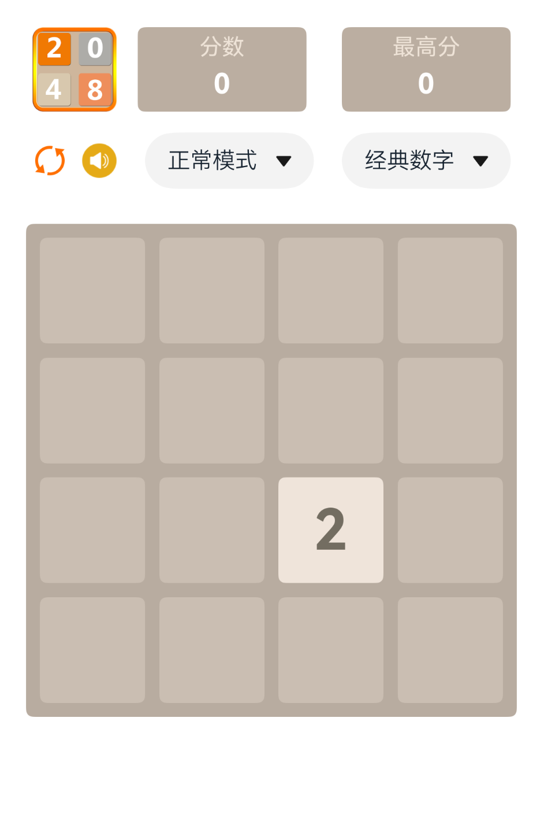
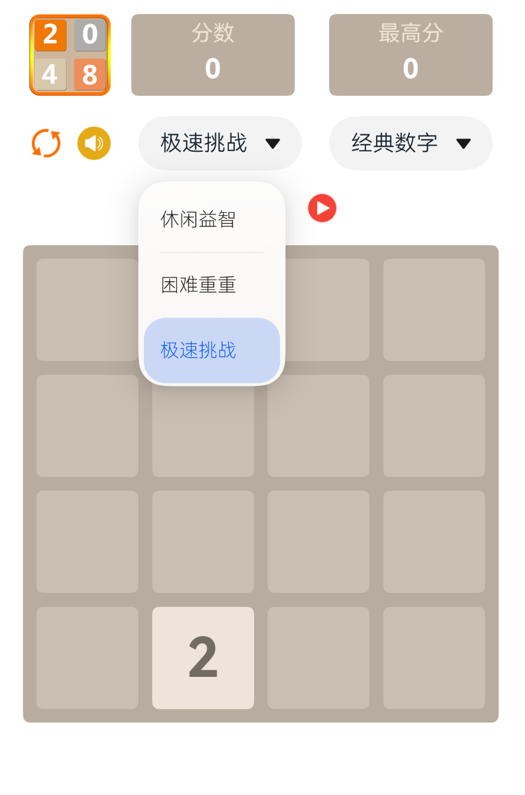
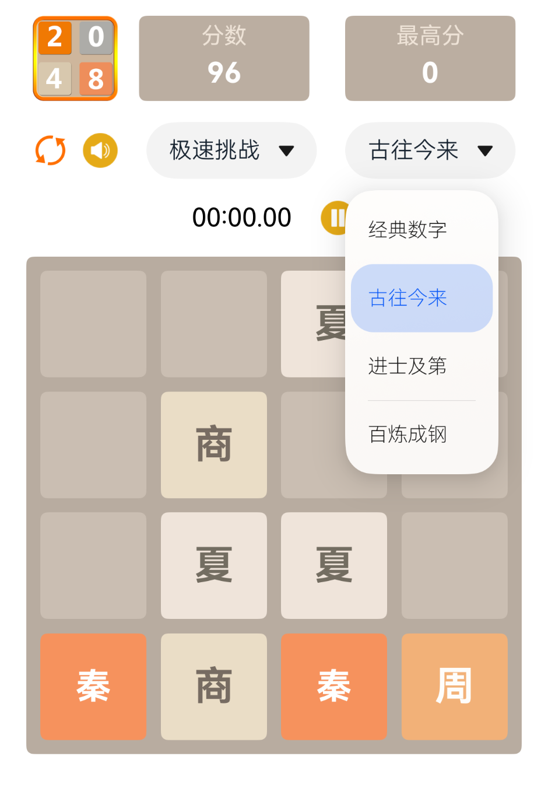
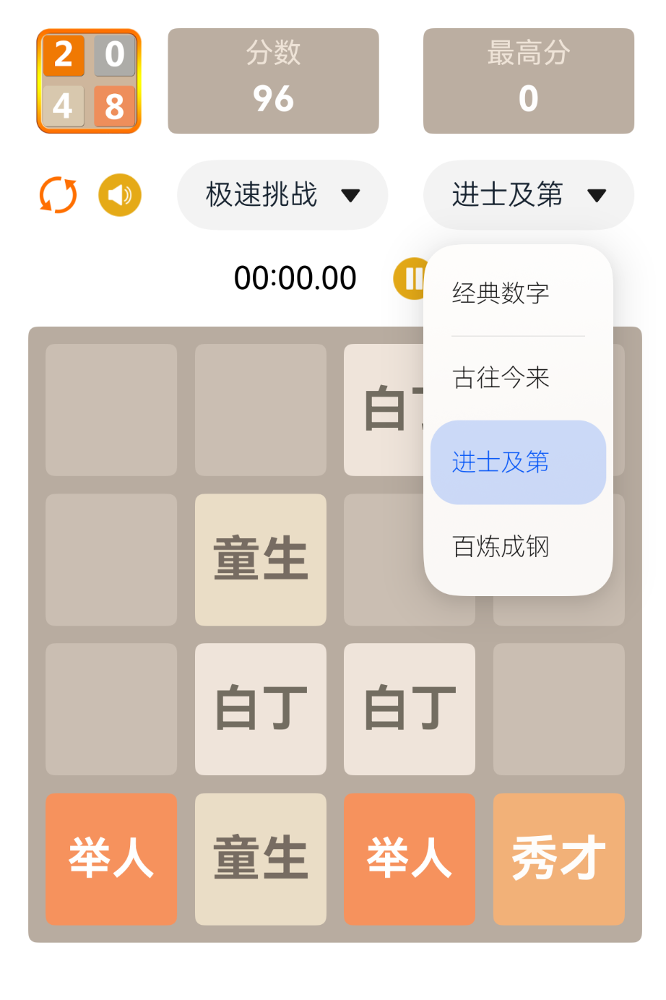
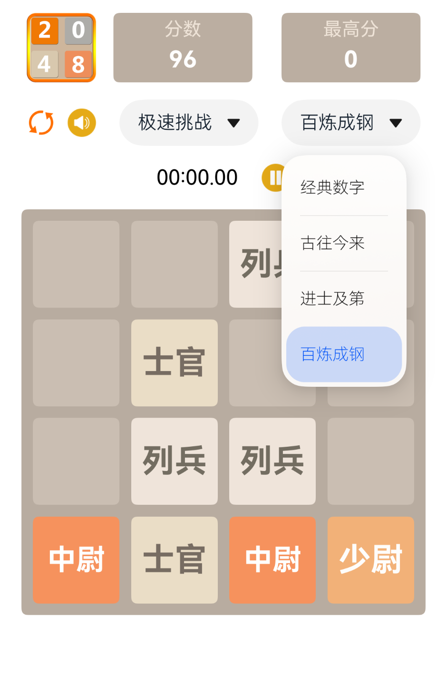

# 鸿蒙HarmonyOS 实现 2048 小游戏

## 介绍
2048是一个简单有趣的数字益智游戏。需要玩家上、下、左、右滑动屏幕合并相同数字，得到一个更大的数字，最终得到2048方块！这个2048游戏是目前流行的2048游戏的经典4x4版本。准备迎接新的挑战！

## 怎么玩
滑动（向上，向下，向左，向右）移动方块。当两个具有相同数字的方块接触时，它们合并成为一个。
合并数字依次得到 4、 8 、16 ...1024、2048、4096...，数字越大得分越高。

## 实现计划
第一个 HarmonyOS 练手项目，实现 2048游戏功能， 计划实现主要功能点：
- 实现2048 游戏主体，使用4*4 二维数组实现数据结构，通过响应滑动手势实现得分判定、数据更新、游戏结束判断等基础功能
- 增加游戏模式选择：正常模式、难度重重、限时挑战等功能
- 实现游戏主题切换功能：数字主题、古往今来、进士及第、士兵突击等
- 增加微信分享下载功能
- 实现最高分数保存、积分领取、广告植入等功能能
- 实现悔棋、救命等功能（回退到上一步，或者消除随机数的功能）
- 实现游戏账号或者微信一键登录，记录比分排名，包括世界排名和微信好友排名，提升游戏在朋友之间的互动性

## 特点
- 鸿蒙版本
- 经典（4x4）方块！
- 纯单机，无需登录，操作流畅
- 多种游戏模式和自定义主题，趣味性更高，边玩边学习
- 完全免费、无任何广告

## Commit History
- 实现基本的动作逻辑和 UI
- 实现得分记录的保存，优化UI
- 实现重新开始游戏功能
- 更新应用图标和名称
- 实现游戏难度模式切换功能，支持模式选择：正常模式、难度重重、限时挑战
- 优化界面布局
- 增加多种主题模式：经典数字，古往今来，进士及第，百炼成钢
- 增加动画音效+优化UI图标
- 增加编译构建配置、开启代码混淆

## Release History
- [v1.0.0](./Release/2048_v1.0.0.app)
- 
## 细节介绍
### 首页

### 游戏模式选择
- 正常模式
- 困难重重
- 极速挑战

### 游戏主题选择
- 古往今来

- 进士及第

- 百炼成钢

## 希望您享受这个游戏！
