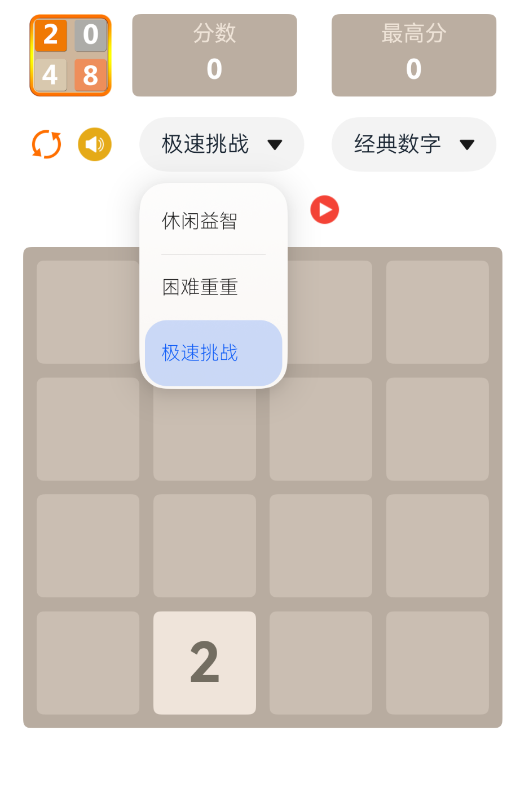
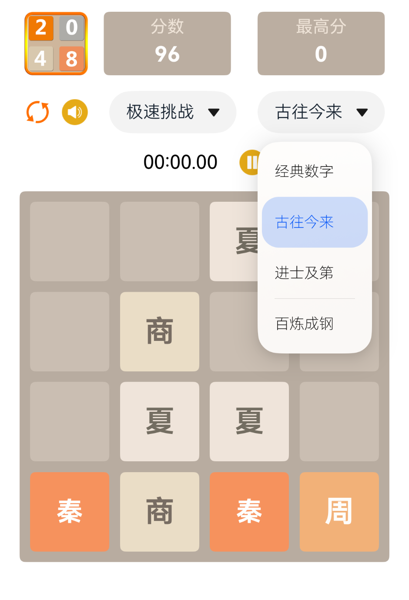
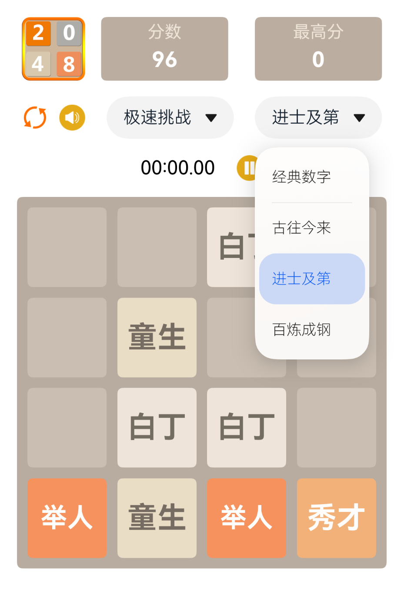

# 2048
keyword: Harmony OS App 2048 小游戏，鸿蒙 app
自己开发的 2048 休闲益智小游戏，鸿蒙系统专属。
支持模式选择：正常模式（默认）、难度重重、限时挑战
支持主题选择：数字主题（默认）、古往今来、进士及第、百炼成钢等

## 介绍
2048是一个简单有趣的数字益智游戏。需要玩家上、下、左、右滑动屏幕合并相同数字，得到一个更大的数字，最终得到2048方块！这个2048游戏是目前流行的2048游戏的经典4x4版本。准备迎接新的挑战！

## 怎么玩
滑动（向上，向下，向左，向右）移动方块。当两个具有相同数字的方块接触时，它们合并成为一个。
合并数字依次得到 4、 8 、16 ...1024、2048、4096...，数字越大得分越高。

## 特点
鸿蒙版本
经典（4x4）方块！
纯单机，无需登录，操作流畅
多种游戏模式和自定义主题，趣味性更高，边玩边学习
完全免费、无任何广告

## 细节
### 首页

### 游戏模式选择

### 游戏主题选择
- 古往今来

- 进士及第

- 百炼成钢

希望您享受这个游戏！